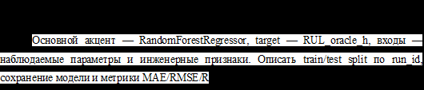

# 3.7. Реализация аналитического прогнозирования и rule-based baseline

В текущей реализации аналитическое прогнозирование целесообразно рассматривать вместе с rule-based baseline. Rule-based baseline отвечает за интерпретируемое определение состояния фильтра и рекомендации по техническому обслуживанию на основе порогов `dp_warn_kpa`, `dp_crit_kpa`, `planned_maintenance_rul_h` и `urgent_maintenance_rul_h`. Аналитический RUL при этом используется как объяснимая оценка остаточного ресурса, fallback при недостаточном доверии к ML и точка сравнения для ML-прогноза.

Расчет аналитического RUL выполняется в модуле `src/simulator/labels.py` при формировании меток временного ряда, а пороговая baseline-логика реализована в `src/rules/baseline.py`. Такое разделение отражает две разные задачи: сначала симулятор рассчитывает диагностические состояния и оценки RUL, затем rule-based baseline использует эти оценки и наблюдаемую телеметрию для формирования понятной рекомендации.

| Функция | Назначение |
|---|---|
| `label_run(cfg, df)` | Добавляет к полному временному ряду диагностические состояния, тревожный флаг, oracle-RUL, аналитический RUL, флаг неизвестного RUL и простой индекс близости к критическому состоянию. Эта функция связывает физический расчет симулятора с дальнейшими диагностическими слоями. |
| `_true_delta_p_norm(cfg, df)` | Рассчитывает нормированный истинный перепад давления по чистым данным симулятора. Учитывает расход и температурную поправку, чтобы состояние отражало именно рост сопротивления фильтра, а не изменение режима эксплуатации. |
| `_observed_delta_p_norm(cfg, df)` | Рассчитывает нормированный наблюдаемый перепад давления по измеренным каналам. Используется для определения наблюдаемого состояния фильтра и последующей rule-based логики. |
| `_states(values, cfg)` | Преобразует значения нормированного перепада в состояния `normal`, `warning`, `critical` или `unknown` по порогам `dp_warn_kpa` и `dp_crit_kpa`. |
| `_rul_oracle(delta_p_true, cfg)` | Вычисляет эталонный остаточный ресурс для синтетических данных как время до ближайшего будущего достижения критического порога. Используется для обучения и проверки моделей, но не является входом в промышленную диагностику. |
| `_rul_analytic(cfg, df)` | Рассчитывает аналитическую оценку RUL через текущий уровень засорения, критический уровень засорения и скорость деградации. Эта оценка интерпретируема, поэтому используется как fallback и как ориентир для сравнения с ML-RUL. |
| `apply_rule_baseline(cfg, df)` | Применяет пороговые правила к временному ряду: определяет `rule_state`, тревожный флаг, рекомендацию по обслуживанию и текстовое обоснование. Состояние определяется по нормированному перепаду, а рекомендация строится по аналитическому RUL и усиливается при критическом состоянии или проблемах качества данных. |
| `_delta_p_norm(cfg, df)` | Рассчитывает нормированный перепад давления для rule layer по наблюдаемым каналам. Компенсирует влияние расхода через отношение `q_m3h / q_nominal_m3h` и показатель `alpha_flow`. |
| `_reason(cfg, row)` | Формирует текстовое объяснение, почему rule-based baseline выдал конкретное состояние и рекомендацию. В объяснение включаются сработавший диапазон `delta_p_norm_kpa` и правило по `rul_analytic_h`. |
| `export_rule_baseline(cfg, baseline, output_dir)` | Сохраняет результаты rule-based baseline в CSV и Parquet, формирует русифицированную CSV-версию и Markdown-описание примененных правил. |
| `_to_russian_csv(baseline, path)` | Создает русифицированную таблицу результатов rule-based baseline: переименовывает колонки и переводит значения состояний, качества данных и рекомендаций на русский язык. |
| `_description(cfg)` | Генерирует Markdown-описание пороговой логики rule-based baseline: правила состояния, правила рекомендаций и список выходных файлов. |
