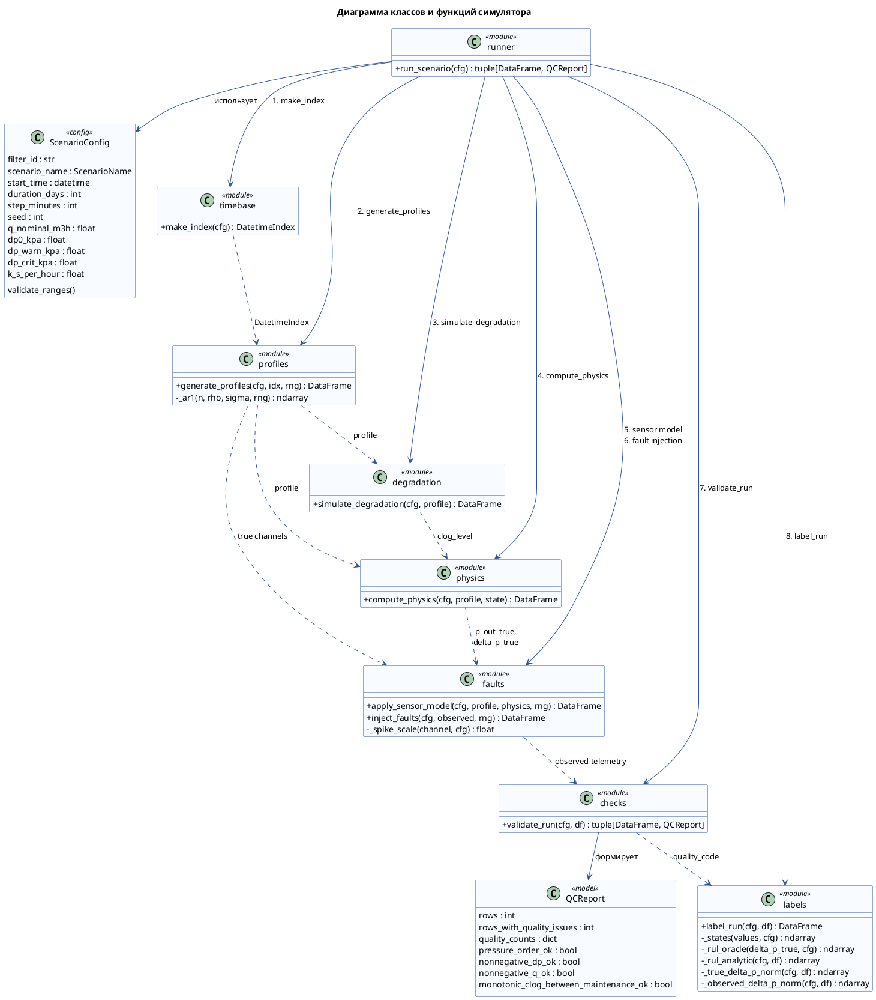

# Глава 3. Программная реализация

Документ является рабочим черновиком третьей главы. В этой главе описывается программная реализация прототипа системы прогнозирования остаточного ресурса газового фильтра и формирования рекомендаций по техническому обслуживанию.

Принятая условность для текста ВКР: в архитектурном описании система использует базу данных PostgreSQL для хранения телеметрии, рассчитанных признаков, прогнозов, решений и результатов экспериментов. CSV/Parquet-файлы, которые сейчас формируются в прототипе, рассматриваются как экспериментальный формат выгрузки и отладки, а не как целевое промышленное хранилище.

## Оглавление

### 3.1. Общие сведения о работе системы

Программный продукт разработан на языке Python. Для обработки табличных данных используются библиотеки pandas и NumPy, для построения модели машинного обучения применяется библиотека scikit-learn, для сохранения обученной модели используется joblib, для интерактивной визуализации применяется Plotly в Streamlit. Параметры вычислительного эксперимента задаются с помощью YAML-конфигурации.

Программный продукт реализует последовательный вычислительный контур, включающий генерацию синтетической телеметрии газового фильтра, расчет диагностических признаков, аналитическую оценку остаточного ресурса, обучение модели машинного обучения и формирование итоговой рекомендации по техническому обслуживанию. Общая логика работы системы строится как конвейер обработки данных: результат каждого этапа используется на следующем этапе.

В качестве целевого хранилища данных в архитектуре системы используется СУБД PostgreSQL. В базе данных предполагается хранение конфигураций экспериментов, временных рядов телеметрии, рассчитанных признаков, аналитических оценок, ML-прогнозов, гибридных решений, метрик качества и журналов объяснения решений. В текущей экспериментальной реализации также формируются файловые выгрузки, которые используются для отладки, проверки расчетов и построения отчетных материалов.

Работа системы начинается с загрузки конфигурации сценария. После этого строится временная сетка, формируются профили расхода газа, входного давления и температуры, рассчитывается скрытая деградация фильтра, перепад давления и наблюдаемые значения датчиков. Далее выполняется проверка качества данных, расчет диагностических состояний, подготовка признаков, построение аналитического и ML-прогноза остаточного ресурса. На заключительном этапе гибридный слой принятия решений выбирает итоговый RUL, рассчитывает уровень доверия и формирует действие по обслуживанию.

### 3.2. Функциональное назначение программного продукта

Разработанный программный продукт предназначен для моделирования процесса эксплуатации газового фильтра и исследования методов прогнозирования его остаточного ресурса. Программа позволяет формировать синтетические временные ряды телеметрии, моделировать постепенное засорение фильтра, рассчитывать диагностические признаки, сравнивать аналитический и ML-подходы к оценке остаточного ресурса, а также формировать объяснимые рекомендации по техническому обслуживанию.

Программа имеет следующие функциональные возможности:

- загрузка параметров эксперимента из YAML-конфигурации;
- генерация временного ряда работы газового фильтра;
- моделирование изменения расхода газа, входного давления и температуры;
- моделирование скрытого уровня засорения фильтра;
- расчет истинного перепада давления и выходного давления;
- моделирование шумов, дрейфа и дефектов датчиков;
- проверка качества данных и выявление физически некорректных наблюдений;
- расчет диагностического состояния фильтра;
- расчет oracle-RUL для синтетических данных;
- расчет аналитического RUL;
- формирование диагностических признаков для анализа и ML-модели;
- обучение ML-модели для прогнозирования остаточного ресурса;
- расчет метрик качества ML-прогноза;
- выбор итогового RUL на основе гибридной логики;
- формирование рекомендации по обслуживанию, приоритета и срока выполнения;
- сохранение результатов эксперимента в структуре данных, ориентированной на PostgreSQL;
- построение диагностических графиков для анализа результатов.

Программа имеет следующие функциональные ограничения:

- система является исследовательским прототипом и не предназначена для прямого управления промышленным оборудованием;
- входные данные формируются симулятором, поэтому результаты требуют дальнейшей проверки на реальных производственных данных;
- ML-модель обучается на синтетических сценариях и используется только как baseline для оценки применимости подхода;
- классификация состояния фильтра средствами ML на текущем этапе не используется, состояние определяется пороговыми правилами;
- интеграция с реальными датчиками, SCADA-системами и промышленными базами данных в текущей версии не реализована;
- PostgreSQL рассматривается как целевая архитектура хранения, тогда как текущий прототип дополнительно использует экспериментальные файловые выгрузки для проверки и анализа.

### 3.3. Выполнение программного продукта

Выполнение программного продукта начинается с подготовки конфигурационного файла, в котором задаются параметры моделируемого фильтра, длительность эксперимента, шаг дискретизации временного ряда, параметры расхода газа, давления, температуры, деградации фильтра, шумов датчиков, дефектов данных и порогов диагностических состояний.

В текущей реализации основной конфигурационный файл имеет формат YAML. Пользователь задает сценарий эксперимента, после чего программный продукт выполняет полный расчетный контур без необходимости ручного запуска отдельных модулей. Основной запуск программы выполняется из корневого каталога проекта командой:

```powershell
.\.venv\Scripts\python.exe main.py
```

Структура основного конфигурационного файла `base.yaml` приведена в таблице 3.1.

Таблица 3.1 - Структура конфигурационного файла `base.yaml`

| Группа параметров | Параметр | Назначение |
|---|---|---|
| Общие параметры эксперимента | `filter_id` | Идентификатор моделируемого фильтра. Используется в выходных наборах данных и карточках решений. |
| Общие параметры эксперимента | `scenario_name` | Название сценария моделирования: нормальная работа, медленное засорение, быстрое засорение, скачки расхода или дефекты датчиков. |
| Общие параметры эксперимента | `start_time` | Начальная дата и время временного ряда. |
| Общие параметры эксперимента | `duration_days` | Длительность моделирования в сутках. |
| Общие параметры эксперимента | `step_minutes` | Шаг дискретизации временного ряда в минутах. |
| Общие параметры эксперимента | `seed` | Начальное значение генератора случайных чисел для воспроизводимости эксперимента. |
| Расход газа | `q_nominal_m3h` | Номинальный расход газа, относительно которого нормируется перепад давления. |
| Расход газа | `q_min_m3h` | Минимальное допустимое значение расхода в профиле режима. |
| Расход газа | `q_max_m3h` | Максимальное допустимое значение расхода в профиле режима. |
| Расход газа | `a_q` | Амплитуда суточных колебаний расхода относительно номинального уровня. |
| Расход газа | `q_ar_rho` | Коэффициент памяти AR(1)-шума расхода. Если параметр не указан в YAML, используется значение по умолчанию из схемы конфигурации. |
| Расход газа | `q_process_std_m3h` | Стандартное отклонение плавных случайных колебаний расхода. Если параметр не указан в YAML, используется значение по умолчанию. |
| Входное давление | `p_in_nominal_mpa` | Номинальное входное давление перед фильтром. |
| Входное давление | `p_min_mpa` | Минимально допустимое давление, используемое в проверках безопасности. |
| Входное давление | `p_max_mpa` | Максимально допустимое давление. |
| Входное давление | `a_p_mpa` | Амплитуда колебаний входного давления. |
| Входное давление | `p_process_std_mpa` | Стандартное отклонение плавных случайных колебаний давления. Если параметр не указан в YAML, используется значение по умолчанию. |
| Температура газа | `t_nominal_c` | Номинальная температура газа, используемая в физической модели. |
| Температура газа | `t_min_c` | Нижняя граница температуры в профиле режима. |
| Температура газа | `t_max_c` | Верхняя граница температуры в профиле режима. |
| Температура газа | `a_t_c` | Амплитуда температурных колебаний. |
| Температура газа | `t_process_std_c` | Стандартное отклонение плавных случайных колебаний температуры. Если параметр не указан в YAML, используется значение по умолчанию. |
| Перепад давления и RUL | `dp0_kpa` | Базовый перепад давления на чистом фильтре при номинальном расходе. |
| Перепад давления и RUL | `dp_warn_kpa` | Порог предупредительного состояния по нормированному перепаду давления. |
| Перепад давления и RUL | `dp_crit_kpa` | Порог критического состояния по нормированному перепаду давления. |
| Перепад давления и RUL | `planned_maintenance_rul_h` | Горизонт планового обслуживания по остаточному ресурсу. |
| Перепад давления и RUL | `urgent_maintenance_rul_h` | Горизонт срочного обслуживания по остаточному ресурсу. |
| Деградация фильтра | `c0` | Начальный скрытый уровень засорения фильтра. |
| Деградация фильтра | `k_s_per_hour` | Базовая скорость роста засорения в час. |
| Деградация фильтра | `alpha_flow` | Степень влияния расхода на перепад давления. |
| Деградация фильтра | `gamma_load` | Степень влияния расхода на скорость накопления засорения. |
| Деградация фильтра | `k_c` | Коэффициент влияния засорения на сопротивление фильтра. |
| Деградация фильтра | `beta` | Нелинейность влияния засорения на сопротивление фильтра. |
| Деградация фильтра | `k_mu_per_c` | Температурный коэффициент поправки перепада давления. |
| Шумы датчиков | `sigma_p_mpa` | Стандартное отклонение шума датчиков давления. |
| Шумы датчиков | `sigma_q_rel` | Относительный шум датчика расхода. |
| Шумы датчиков | `sigma_t_abs_c` | Абсолютный шум датчика температуры. |
| Дефекты и качество данных | `p_missing` | Вероятность пропуска значения наблюдаемого канала на одном шаге. |
| Дефекты и качество данных | `p_spike` | Вероятность кратковременного выброса датчика. |
| Дефекты и качество данных | `p_stuck` | Вероятность начала участка залипания датчика. |
| Дефекты и качество данных | `bias_drift_mpa_per_day` | Скорость дрейфа давления в МПа за сутки. |
| Дефекты и качество данных | `stuck_min_steps` | Минимальная длительность участка залипания датчика в шагах. Если параметр не указан в YAML, используется значение по умолчанию. |
| Дефекты и качество данных | `stuck_max_steps` | Максимальная длительность участка залипания датчика в шагах. Если параметр не указан в YAML, используется значение по умолчанию. |
Помимо основного файла `base.yaml`, для сравнительных экспериментов используется файл `scenarios.yaml`. Он задает набор сценариев пакетного запуска. В отличие от `base.yaml`, в нем не повторяется полный набор параметров. Для каждого сценария указываются только значения, которые должны отличаться от базовой конфигурации.

Структура блока сценария в файле `scenarios.yaml` приведена в таблице 3.2.

Таблица 3.2 - Структура блока сценария в `scenarios.yaml`

| Поле | Назначение |
|---|---|
| Имя блока верхнего уровня | Логическое имя сценария в наборе экспериментов. Например, `normal`, `slow_clogging`, `rapid_clogging`. |
| `scenario_name` | Имя встроенного сценария, которое должно совпадать с допустимым значением `ScenarioName` в программной конфигурации. |
| `duration_days` | Длительность моделирования для конкретного сценария. Позволяет задавать более короткий или более длинный горизонт эксперимента. |
| Дополнительные параметры конфигурации | Любой параметр из схемы `ScenarioConfig`, который требуется переопределить для конкретного сценария. Остальные значения берутся из базовой конфигурации и встроенных сценарных переопределений. |

В таблице 3.3 приведены сценарии, описанные в `scenarios.yaml`.

Таблица 3.3 - Сценарии сравнительных экспериментов

| Сценарий | `scenario_name` | Длительность | Назначение |
|---|---|---:|---|
| `normal` | `normal` | 30 суток | Контрольный здоровый сценарий. Фильтр почти не засоряется, дефектов данных мало. |
| `slow_clogging` | `slow_clogging` | 90 суток | Базовый сценарий постепенного засорения. Используется для демонстрации переходов `normal -> warning -> critical`. |
| `rapid_clogging` | `rapid_clogging` | 45 суток | Сценарий ускоренного засорения. Нужен для проверки реакции правил и моделей на быстрое ухудшение состояния фильтра. |
| `flow_spikes` | `flow_spikes` | 30 суток | Сценарий со скачками расхода. Используется для демонстрации отличия сырого перепада давления от нормированного перепада. |

Дополнительно в программной схеме предусмотрены сценарии `sensor_bias`, `sensor_stuck` и `missing_data`. Они используются для стресс-проверок качества данных и могут быть добавлены в `scenarios.yaml` аналогичным образом.

При запуске выполняется загрузка конфигурации, создание объекта конфигурации сценария и последовательное выполнение всех этапов обработки данных. Общая последовательность выполнения программного продукта представлена ниже:

```text
загрузка YAML-конфигурации
-> построение временной сетки
-> генерация профилей технологического режима
-> моделирование деградации фильтра
-> расчет физической модели перепада давления
-> моделирование показаний датчиков
-> внесение дефектов данных
-> проверка качества данных
-> расчет состояний и RUL
-> формирование диагностических признаков
-> inference ML baseline
-> построение гибридного RUL
-> сохранение результатов
-> построение графиков
```

На этапе загрузки конфигурации задаются базовые параметры эксперимента: идентификатор фильтра, название сценария, дата начала моделирования, длительность моделирования, шаг дискретизации и seed генератора случайных чисел. Эти параметры обеспечивают воспроизводимость эксперимента.

После загрузки конфигурации формируется временной ряд, соответствующий заданной длительности моделирования. Далее генерируются истинные профили расхода газа, входного давления и температуры. На основе профиля расхода рассчитывается скрытый уровень засорения фильтра, который определяет изменение сопротивления фильтра во времени.

Следующий этап выполняет физический расчет перепада давления на фильтре и выходного давления. После этого к истинным значениям применяются модели датчиков: добавляются шумы измерений, возможный дрейф, пропуски, выбросы и залипания. Таким образом формируется наблюдаемая телеметрия, приближенная к данным, которые могли бы поступать из промышленной системы мониторинга.

После формирования наблюдаемой телеметрии выполняется проверка качества данных. Для каждой временной точки определяется код качества, отражающий нормальное состояние данных, наличие пропусков или физически некорректные значения. Затем рассчитывается диагностическое состояние фильтра, oracle-RUL для синтетических данных и аналитическая оценка остаточного ресурса.

Далее система формирует набор диагностических признаков. Эти признаки используются для анализа временного ряда, ML-прогноза и работы гибридного слоя RUL.

На следующем этапе выполняется inference ML baseline. В текущей версии используется модель `RandomForestRegressor`, которая прогнозирует остаточный ресурс фильтра по наблюдаемым и производным признакам. Обучение запускается отдельной командой и сохраняет модель в PostgreSQL.

После получения аналитического и ML-прогноза запускается гибридный слой RUL. Он оценивает доверие к данным, доверие к ML-прогнозу и согласованность аналитического и ML-прогноза. На основе этих величин выбирается итоговый RUL, источник прогноза и итоговое доверие.

Результаты работы программного продукта в целевой архитектуре сохраняются в базе данных PostgreSQL. В базе данных предполагается хранить конфигурации запусков, телеметрию, рассчитанные признаки, прогнозы, метрики качества, гибридные решения и объяснения. В экспериментальной реализации дополнительно формируются файловые выгрузки, которые используются для проверки корректности расчетов и подготовки иллюстративных материалов.

По завершении выполнения программный продукт формирует:

- временные ряды наблюдаемой телеметрии;
- скрытые истинные значения симулятора;
- диагностические признаки;
- аналитические оценки остаточного ресурса;
- ML-прогнозы остаточного ресурса;
- метрики качества ML-модели;
- гибридные решения по обслуживанию;
- диагностические графики;
- текстовые описания и карточки объяснения решений.

Таким образом, выполнение программного продукта представляет собой единый воспроизводимый конвейер, который позволяет провести вычислительный эксперимент от генерации исходной телеметрии до формирования итоговой рекомендации по техническому обслуживанию газового фильтра.

### 3.4. Архитектура программной системы

В разделе будет описана общая архитектура системы и взаимодействие основных компонентов.

Основной контур:

```text
configuration
-> simulator
-> feature builder
-> analytic RUL
-> ML baseline
-> hybrid RUL fusion
-> visualization
-> PostgreSQL storage
```

#### 3.4.1. Описание программных модулей

В подразделе будет кратко описано назначение модулей:

- `Simulator` - генерация временного ряда и физической траектории фильтра;
- `Feature Builder` - расчет диагностических признаков;
- `Analytic RUL` - интерпретируемая аналитическая оценка остаточного ресурса;
- `ML Baseline` - прогнозирование RUL на основе RandomForestRegressor;
- `Hybrid RUL Fusion` - выбор итогового RUL, расчет доверия и источника прогноза;
- `Visualization` - построение диагностических графиков;
- `Exporters / Storage` - сохранение результатов в PostgreSQL и экспериментальные выгрузки.

Подробные алгоритмы здесь не раскрываются, чтобы не дублировать следующие разделы.

#### 3.4.2. Общее описание базы данных и даталогическая модель данных

В подразделе будет описана целевая структура хранения данных в PostgreSQL.

Предполагаемые сущности:

- прогоны симуляции;
- конфигурации сценариев;
- наблюдаемая телеметрия;
- истинные скрытые значения симулятора;
- рассчитанные признаки;
- аналитические оценки RUL;
- ML-прогнозы;
- гибридные решения;
- метрики качества;
- журналы объяснений и правил.

Здесь позже нужно будет добавить даталогическую модель: таблицы, ключевые поля, связи и назначение основных колонок.

### 3.5. Реализация симулятора

Симулятор реализован как последовательный вычислительный конвейер, в котором каждый этап получает результаты предыдущего этапа и добавляет к ним новый набор расчетных данных. Центральной точкой запуска является функция `run_scenario(cfg)` из модуля `src/simulator/runner.py`. На вход она получает объект `ScenarioConfig`, содержащий параметры сценария, временной сетки, физических коэффициентов, шумов датчиков, дефектов данных и порогов диагностики. На выходе формируется таблица `DataFrame` с полным временным рядом и объект `QCReport` с результатами контроля качества.

Основной контур симуляции имеет следующую последовательность:

```text
timebase
-> profiles
-> degradation
-> physics
-> sensor model
-> fault injection
-> validation
-> labels and RUL
```

На этапе `timebase` функция `make_index(cfg)` строит равномерную временную сетку `DatetimeIndex`. Количество точек определяется длительностью эксперимента `duration_days` и шагом дискретизации `step_minutes`. Эта сетка задает общий временной каркас для всех последующих расчетов.

На этапе `profiles` функция `generate_profiles(cfg, idx, rng)` формирует истинные технологические режимы работы фильтра: расход газа `q_true_m3h`, входное давление `p_in_true_mpa` и температуру `t_true_c`. Расход задается как сумма номинального значения, суточной сезонности, недельной сезонности и плавного AR(1)-шума. Для сценария `flow_spikes` дополнительно вводятся кратковременные всплески расхода. Давление и температура также получают суточные колебания и коррелированный процессный шум. Результатом этапа является таблица истинных режимных параметров без ошибок измерения.

На этапе `degradation` функция `simulate_degradation(cfg, profile)` рассчитывает скрытое состояние фильтра `clog_level`. Засорение увеличивается на каждом шаге с базовой скоростью `k_s_per_hour`, а влияние текущей нагрузки учитывается через расход газа и показатель `gamma_load`. В текущей версии симулятора сброс засорения обслуживанием не моделируется, поэтому `clog_level` монотонно растет внутри одного прогона. Это состояние является скрытым: в реальной эксплуатации оно напрямую не измеряется, но в симуляторе используется для построения физической модели и проверки качества алгоритмов.

На этапе `physics` функция `compute_physics(cfg, profile, state)` рассчитывает истинный перепад давления на фильтре и выходное давление. Перепад давления зависит от базового перепада `dp0_kpa`, расхода относительно номинала, температурной поправки и множителя сопротивления, который определяется уровнем засорения. В результате формируются `resistance_factor`, `delta_p_true_kpa` и `p_out_true_mpa`.

На этапе `sensor model` функция `apply_sensor_model(cfg, profile, physics, rng)` преобразует истинные физические величины в наблюдаемую телеметрию. К давлениям добавляются шум и возможный линейный дрейф, расход получает относительный шум, температура - абсолютный шум. Наблюдаемый перепад `delta_p_kpa` вычисляется как разность наблюдаемых давлений `p_in_mpa` и `p_out_mpa`, переведенная из МПа в кПа. Таким образом отделяется идеальная физическая траектория от данных, которые могли бы поступать с датчиков.

На этапе `fault injection` функция `inject_faults(cfg, observed, rng)` имитирует дефекты телеметрии. Для каналов давления, расхода и температуры могут появляться пропуски, одиночные выбросы и участки залипания датчика. После внесения дефектов значения ограничиваются физически допустимыми диапазонами, а перепад давления пересчитывается по поврежденным наблюдаемым каналам.

На этапе `validation` функция `validate_run(cfg, df)` проверяет физическую корректность и качество строк. Она определяет пропуски, нарушение порядка давлений `p_out_mpa <= p_in_mpa`, отрицательный перепад давления, отрицательный расход и монотонность скрытого засорения. Для каждой строки назначается `quality_code`: `good`, `missing` или `invalid`. Дополнительно формируется объект `QCReport`, содержащий количество строк, число проблемных строк и результаты агрегированных проверок.

На этапе `labels and RUL` функция `label_run(cfg, df)` добавляет диагностические метки и оценки остаточного ресурса. Сначала рассчитывается нормированный перепад давления по истинным и наблюдаемым данным. Затем по порогам `dp_warn_kpa` и `dp_crit_kpa` формируется наблюдаемое состояние `state_obs`. Если качество строки не является `good`, наблюдаемое состояние переводится в `unknown`. Далее вычисляются истинный oracle-RUL `rul_oracle_h`, аналитическая оценка `rul_analytic_h` и флаг неизвестного RUL.

Результаты отдельных этапов объединяются в `run_scenario(...)` через `pd.concat([profile, degradation, physics, observed], axis=1)`. После этого добавляются служебные поля `run_id`, `filter_id` и `scenario_id`, выполняется контроль качества и назначение меток. Такая организация позволяет сохранять в одном наборе данных как наблюдаемую телеметрию, так и скрытые истинные значения симулятора, необходимые для обучения и проверки алгоритмов.

Диаграмма классов и вычислительных функций симулятора приведена ниже. В текущей реализации большинство сущностей являются не классами с внутренним состоянием, а модулями с чистыми расчетными функциями, поэтому на диаграмме они показаны как классы со стереотипом `<<module>>`.



Отдельный файл диаграммы для рендеринга PlantUML: `simulator_class_diagram.puml`.

### 3.6. Реализация подготовки признаков

В разделе будет описан расчет признаков, которые используются для диагностики, ML-прогнозирования и гибридного слоя.

Планируемые признаки:

- нормированный перепад давления `deltaP_norm_kPa`;
- скользящее среднее перепада за 1 час;
- стандартное отклонение перепада за 1 час;
- тренд нормированного перепада за 6 часов;
- средний расход за 1 час;
- доля пропусков за 1 час;
- время выше warning-порога.

Для каждого признака позже нужно добавить назначение, формулу и место использования.

### 3.7. Реализация аналитического прогнозирования

В разделе будет описан аналитический расчет остаточного ресурса фильтра.

Нужно раскрыть:

- расчет критического уровня засорения;
- расчет текущей скорости деградации;
- формулу аналитического RUL;
- роль аналитического RUL как интерпретируемой оценки, fallback и точки сравнения для ML.

### 3.8. Реализация ML-прогнозирования

В разделе будет описано обучение ML baseline.

Нужно указать:

- используемую модель `RandomForestRegressor`;
- входные признаки;
- целевую переменную `RUL_oracle_h`;
- принцип формирования train/test split по независимым прогонам;
- метрики качества: MAE, RMSE, R2;
- сохраняемые результаты модели и прогнозов.

Также нужно отдельно отметить, что классификация состояния фильтра на текущем этапе отключена, а ML используется только для прогноза RUL.

### 3.9. Реализация гибридного слоя принятия решений

В разделе будет описано, как система объединяет ML-прогноз, аналитический RUL, качество данных и продукционные правила.

Нужно раскрыть:

- расчет `confidence_data`;
- расчет `confidence_model`;
- расчет `confidence_consistency`;
- расчет `confidence_total`;
- выбор `RUL_fused_h`;
- выбор источника RUL;
- назначение действия, приоритета и срока выполнения;
- формирование объяснения и трассы правил.

### 3.10. Реализация визуализации

В разделе будет описано, какие графики строятся для анализа работы системы.

Планируемые графики:

- расход газа;
- входное и выходное давление;
- перепад давления;
- засорение фильтра;
- oracle, analytic, ML и fused RUL;
- состояние фильтра;
- нормированный перепад;
- сравнение перепада и засорения;
- окно гибридного решения;
- периоды выбора ML, аналитики и консервативного минимума.

### 3.11. Описание выходных датасетов

В разделе будет описано, какие наборы данных формируются системой и какие сущности должны храниться в PostgreSQL.

Нужно описать:

- наблюдаемую телеметрию;
- скрытые истинные значения симулятора;
- признаки;
- ML-прогнозы;
- гибридные решения;
- метрики качества;
- карточки объяснений.

CSV/Parquet здесь можно упоминать только как дополнительные экспериментальные выгрузки прототипа.

### 3.12. Экспериментальная проверка на сценариях симулятора

В разделе будет описано, на каких сценариях проверяется система.

Сценарии:

- `slow_clogging`;
- `rapid_clogging`;
- `flow_spikes`;
- `sensor_bias`;
- `sensor_stuck`;
- `missing_data`.

Нужно показать, что сценарии покрывают нормальную деградацию, ускоренное засорение, изменения расхода и проблемы качества данных.

### 3.13. Сравнение подходов

В разделе будет выполнено сравнение:

- аналитического RUL;
- ML RUL;
- гибридного RUL.

Нужно объяснить, в чем сильные и слабые стороны каждого подхода и почему итоговая система использует гибридную схему.

### 3.14. Анализ результатов и ограничений

В разделе будет описано, насколько полученные результаты адекватны и какие ограничения имеет прототип.

Планируемые ограничения:

- данные синтетические;
- модель ML обучается на искусственно сгенерированных сценариях;
- RandomForest не моделирует временную последовательность напрямую;
- доверие к модели пока рассчитывается упрощенно;
- PostgreSQL описывается как целевое хранилище, тогда как текущий прототип также формирует файловые выгрузки;
- промышленное применение потребует валидации на реальных данных.

### 3.15. Выводы по главе

В разделе будут кратко сформулированы итоги программной реализации.

Нужно показать, что разработан полный программный контур: симулятор, подготовка признаков, аналитическое прогнозирование, ML-прогнозирование, гибридное принятие решений, визуализация и сохранение результатов.
